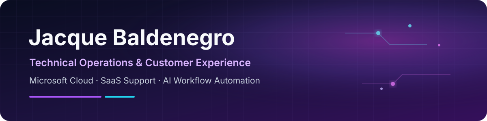
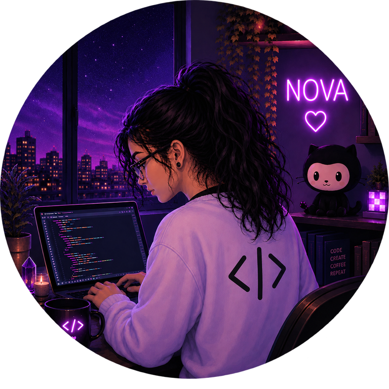

  

  <a href="https://www.linkedin.com/in/jaba6/">LinkedIn</a> ·
  <a href="https://github.com/Ghostixs/nova-system-overview">Nova system overview</a> ·
  Phoenix, Arizona

## Hello, I am Jacque

I have more than 10 years of experience across technical operations, customer experience, SaaS support, Microsoft cloud, sales engineering, implementation support, troubleshooting, requirements discovery, training, documentation, and workflow improvement.

Today I support enterprise Microsoft licensing and operational workflows. I am also building practical skills in AI-enabled operations and enterprise systems by creating Nova, a private self-hosted platform that lets me learn through real implementation, recovery, monitoring, and documentation work.

## Featured project: Nova

**[Nova System Overview](https://github.com/Ghostixs/nova-system-overview)** is a public, security-sanitized case study of my private personal operations environment.

The verified foundation includes Docker under WSL2, private networking, service dashboards, metrics and logs, availability monitoring, Home Assistant, media workflows, credential management, Open WebUI, and documented backup and recovery work.

I built Nova to practice the work behind reliable systems: understanding requirements, connecting services, diagnosing failures, protecting state, documenting decisions, and separating what works today from what is still an experiment.

Advanced AI memory, retrieval, agent routing, MCP tools, and human-approved actions are roadmap items. They are not presented as production capabilities.

 

## Current focus

- AI-enabled customer support workflows
- Enterprise systems and process improvement
- Human-in-the-loop automation
- Knowledge systems and retrieval concepts
- Observability and self-hosted infrastructure
- Technical documentation and user enablement

## Tools and platforms

`Microsoft 365` `Azure fundamentals` `Docker` `Linux` `WSL2` `Git` `GitHub` 
`Grafana` `Prometheus` `Loki` `Home Assistant` `Open WebUI` 
`Salesforce` `ServiceNow` `Zendesk` `SQL fundamentals` `API fundamentals`

## How I work

I learn by building, testing, documenting, and revisiting assumptions. The most valuable parts of Nova have not been flawless first attempts. They have been the moments when a service failed, the evidence conflicted, or a recovery plan needed to become clear enough for another person to follow.

That same approach shapes my professional work: translate ambiguity into a usable process, keep people informed, and leave the system easier to support than I found it.
